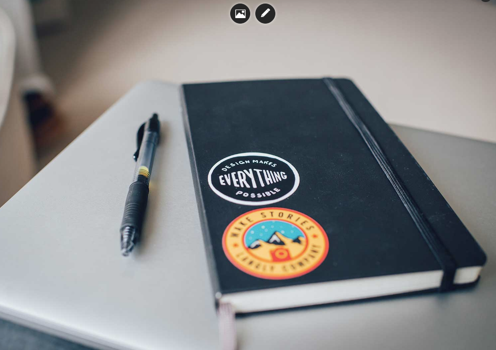
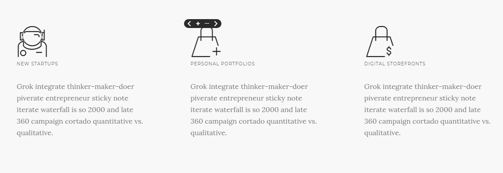

# Tips

1. 处理背景图片

如果要显示用于更改背景图片的句柄，必须添加内联样式。

例子： `style="background-image: url('/path.jpg')"`

此内联样式将显示用于更改选定元素的背景图片的句柄。

标记位于可编辑区域




2. 加载内容模块

你可以通过单击element来显示内容的模块

你必须为你点击的元素设置一个属性`data-mw-dialog`

例如：
```
data-mw-dialog="image.jpg" // image path
data-mw-dialog="http://google.com" // url
data-mw-dialog="#some-element" // id
```

3. 辅助类

提供不同辅助类
```
class = "nodrop"
class = "allow-drop"
class = "safe-mode"
class = "safe-element"
class = "cloneable"
```

类nodrop 禁用元素拖放。

如果使用nodrop包装器，可以对内部元素使用`allow-drop`来允许在内部执行拖放功能。

例子：
```
<div class="nodrop">
  you can not drop here
  <div class="allow-drop">
    you can drop here
  </div>
</div>
```

如果你有复杂的代码结构，你可以使用安全模式来防止破快该结构。你只能对块元素使用该类。

对于不能删除的内联元素，可以使用`safe-element`.

例子：

```
<div class="row wide-grid safe-mode">
    <div class="col-sm-3 col-xs-6 cloneable">
        <div class="feature feature-1 text-center">
            <i class="icon icon--lg icon-Bodybuilding safe-element"></i>
            <h3>16,000+</h3>
            <span class="safe-element"><em><?php _lang("Customers strong"); ?></em></span>
        </div>
    </div>
</div>
```

cloneable 类将向你展示元素上的工具，允许你复制删除或移动元素。




