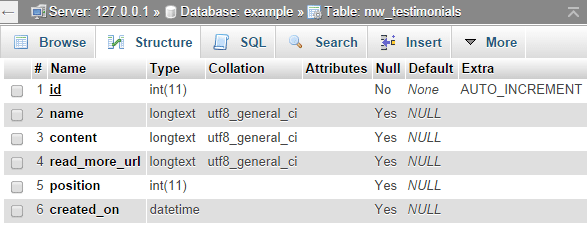

# 使用数据库表创建模块
----------------------------------

本教程将创建一个具有自己数据库表的模块。我们将需要函数来获取和保存数据库中的数据，还需要自定义数据库表。

在本例中，将创建一个'testimonals'模块来显示客户的证明。

## 创建基本文件

创建新文件夹`userfiles/modules/testimonials`

每个模块都需要以下文件才能工作:

文件名 |   描述
--------------
config.php | 你模块的信息
index.php |  此文件加载模块从前端删除或打开
admin.php | 当您从admin或live edit打开模块设置时，将加载此文件
functions.php |  可选文件，它是加载在系统开始与网站
testimonials.png |  模块图标

**config.php**
在`userfiles/modules/ monials/config.php`中创建一个文件，使用这个文件定义模块的名称及其版本，因为它将出现在管理面板中

在`config.ph`p中，可以设置`$config['tables']`数组，该数组可以包含要创建的db表的描述

```
<?php
$config = array();
$config['name'] = "Testimonials";
$config['author'] = "Microweber";
$config['ui'] = true; //if set to true, module will be visible in the toolbar
$config['ui_admin'] = true; //if set to true, module will be visible in the admin panel
$config['categories'] = "content";
$config['position'] = 99;
$config['version'] = 0.1;

$config['tables'] = array(
    "testimonials" => array(
        'id' => "integer",
        'name' => "text",
        'content' => "text",
        'read_more_url' => "text",
        'created_at' => "dateTime",
        'position' => "integer"
    )
);
```

安装模块后，Microweber将为您在数据库中创建这些表。如果打开数据库，您将看到创建了以下SQL表。如果需要控制数据库字段类型，请在这里阅读更多内容(http://laravel.com/docs/5.0/schema)。




**admin.php**

当您删除模块并单击“设置(settings)”时，将加载此文件。使用only_admin_access函数使管理文件仅供管理用户访问。

将代码放在`userfiles/modules/testimonials/admin.php`

```
<?php only_admin_access(); ?>
<h2>This is my settings file</h2>
```

**index.php**

当您删除模块或在代码中包含模块时，将加载此文件。将它放在`userfiles/modules/testimonials/index.php`中，还可以创建css和js文件并加载它们。

```
<link rel="stylesheet" href="<?php print $config['url_to_module']; ?>testimonials.css" />
<script src="<?php print $config['url_to_module']; ?>testimonials.js"></script>
<div class="testimonials-wrapper">
    <h2>This is my testimonials module</h2>
</div>
```


## 加载模块

您可以在代码中加载模块，或者从实时编辑器中插入模块，也可以从管理面板中打开模块。

```
<module type="testimonials" />
```


## lets get busy

是时候开始编写一些代码了。
现在我们已经完成了基本的操作，我们将开始让模块做一些事情并添加一个接口。
在创建接口之前，我们必须创建保存和获取数据的函数。我们还将向api公开很少的函数，这将允许我们对它进行ajax调用。

**functions.php**

我们将需要很少的函数来获取和保存数据库中的数据，所以我们将把它们放在这个文件中。

```
<?php

api_expose('save_testimonial');
function save_testimonial($data)
{
    if (!is_admin()) {
        return;
    }
    $table = "testimonials";
    return db_save($table, $data);
}

function get_testimonials($params=array())
{
    if (is_string($params)) {
        $params = parse_params($params);
    }
    $params['table'] = "testimonials";
    return db_get($params);
}

api_expose('delete_testimonial');
function delete_testimonial($params)
{
    if (!is_admin()) {
        return;
    }
    if (isset($params['id'])) {
        $table = "testimonials";
        $id = $params['id'];
        return db_delete($table, $id);
    }
}

```
注意“save_testimonial”函数之前的api_expose用法，这允许我们从http://example.com/api/save_testimonial调用这个函数。
可以看到，这些函数只是对db_get、db_save和db_delete的引用。


**admin.php**

我们已经准备好了函数，接下来是有趣的部分，添加接口。
为了使我们的模块是动态的，并能够重新加载它的不同部分，我们将它分为几个子模块。
打开userfiles/modules/ monials/admin.php并添加以下代码，以加载添加和列出信息所需的模块

```
<?php only_admin_access(); ?>
<module type="testimonials/edit" id="edit-testimonials" />
<module type="testimonials/list" id="list-testimonials" />

```

**edit.php**

现在您需要创建`userfiles/modules/testimonials/edit.php`文件，我们将使用该文件通过ajax发布。

```
<?php only_admin_access(); ?>
<script>
    $(document).ready(function () {
        $("#add-testimonial-form").submit(function (event) {
            event.preventDefault();
            var data = $(this).serialize();
            var url = "<?php print api_url('save_testimonial'); ?>";
            var post = $.post(url, data);
            post.done(function (data) {
                mw.reload_module("testimonials");
                mw.reload_module("testimonials/list");
            });
        });
    });
</script>

<form id="add-testimonial-form">
  <h3>Add new testimonial</h3>
  <label class="mw-ui-label">Name</label>
  <input type="text" name="name" class="mw-ui-field">
  <label class="mw-ui-label">Content</label>
  <textarea  name="content" class="mw-ui-field"></textarea>
  <input type="submit" name="submit" value="Save" class="mw-ui-btn"/>
</form>
```
当您在代码中放入<module type=" monials/edit" />时，就会加载这个模块，就像我们在admin.php中所做的那样

列出testimonials:

**list.php**

打开`userfiles/modules/testimonials/list.php`，填入代码：

```
<?php only_admin_access(); ?>
<script>
    function delete_testimonial(id) {
        var are_you_sure = confirm("Are you sure?");
        if (are_you_sure == true) {
            var data = {}
            data.id = id;
            var url = "<?php print api_url('delete_testimonial'); ?>";
            var post = $.post(url, data);
            post.done(function (data) {
                mw.reload_module("testimonials");
                mw.reload_module("testimonials/list");
            });
        }
    }
</script>
<?php $data = get_testimonials("no_limit=true"); ?>
<?php if ($data): ?>
    <table width="100%" class="mw-ui-table">
        <thead>
        <tr>
            <th>Name</th>
            <th>Content</th>
            <th></th>
        </tr>
        </thead>
        <tbody>
        <?php foreach ($data as $item): ?>
            <tr>
                <td><?php print $item['name'] ?></td>
                <td><?php print $item['content'] ?></td>
                <td><a class="mw-ui-btn"
                       href="javascript:delete_testimonial('<?php print $item['id'] ?>');">Delete
                    </a>
                </td>
            </tr>
        <?php endforeach; ?>
        </tbody>
    </table>
<?php endif; ?>


```
现在我们有了管理部分。是时候在我们的网站上展示testimonials 了。

**index.php**

`userfiles/modules/testimonials/index.php`，填入以下代码：

```
<link rel="stylesheet" href="<?php print $config['url_to_module']; ?>testimonials.css"/>
<script src="<?php print $config['url_to_module']; ?>testimonials.js"></script>

<?php $data = get_testimonials("no_limit=true"); ?>
<?php if ($data): ?>
    <div id="rotator_<?php print $params['id'] ?>" class="testimonials-wrapper">
        <?php foreach ($data as $item): ?>
            <div class="rotating-item">
                <h3 class="testimonial-name"><?php print $item['name'] ?></h3>
                <div class="testimonial-content"><?php print $item['content'] ?></div>
            </div>
        <?php endforeach; ?>
    </div>
<?php endif; ?>

```

当您在live edit或type `<module type=" monials" />`中删除模块时，`index.php`文件充当模块的"前端"。


