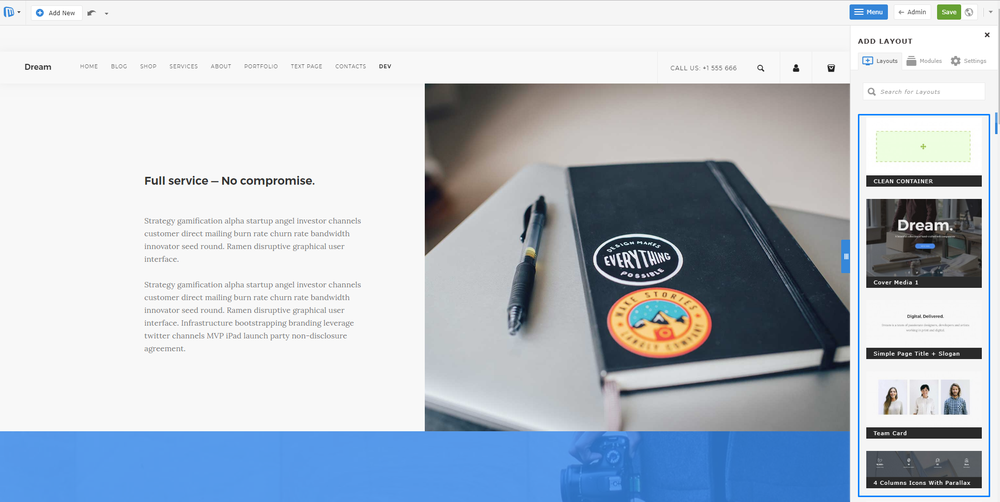

# 创建模板指导

在开发前，必须禁用Compile assets选项：Admin panel -> Settings->Advanced-> Internal settings-> Compile api.js-NO

设置示例路径：http://yourwebsite.com/admin/view:settings#option_group=advanced


## 开始

制作microweber模板很容易。你只需要在`userfiles/templates/`中创建一个新文件夹。模板文件夹名必须是小写，并且除unserscore和dash外，不能包含空格或特殊字符。

让我们在“userfiles/templates/starter”创建一个名为starter的文件夹。

*设置基本文件*

```
/userfiles
  /templates
    /starter
      config.php
      header.php
      index.php
      footer.php
      clean.php
      /assets
      /layouts
      /modules
        /layouts/templates/skin-1.php
        /layouts/templates/skin-1.php
```
在'/assets'文件夹中可以放置静态文件css,js,images。

在config.php文件中设置模板名称
打开"userfiles/templates/starter/config.php"


** 制作header、 footer

每个模板都需要header和footer

header.php
```php
<!DOCTYPE HTML>
<html>
  <head>
  </head>

  <body>

```
可以使用`template_url()`函数将URL获取到模板文件夹。模板的完整文件系统路径也有`template_dir()`。

在呈现站点时，`{content_meta_title}`这样的大括号文本将被替换为适当的内容。

footer.php
```
</body>
</html>
```

## 添加导航菜单、徽标

我们通常会在站点标题中放置导航，并在所有页面上使用设计元素。此外，我们还可以放置全局可编辑区域，这样用户可以在标题中更改器徽标和文本。

你可以使用标记在模板内加载模块。

```
<div>
  <div class="edit" rel="global" field="template_name_header">
    <h1><a href="<?php print site_url(); ?>">my tempalte</a></h1>
    <module type="menu" name="header_menu" id="main-navigation" template="navbar"/>
  </div>
</div>
```
```
<div id="footer" class="edit" rel="global" field="template_name_footer">
  <div>copyright</div>
  <module type="menu" name="footer_nemu"/>
</div>
```

## 模块布局

Layouts模块用于从右侧侧边栏构建具有拖放功能的页面。通过它，可以快速构建页面。


*创建模块布局*

模块布局的创建很容易。您必须在模板文件夹中创建文件夹layouts/templates，其中必须包含skin-1.php和skin-1.png，其中1是布局的增量数量。如果您想创建更多的第二个或第三个布局，它们的名称必须是skin-2.php和skin-3.php(带有屏幕截图skin-2.png和skin-3.png)

3的结构必须如下所示: 

```
/userfiles
    /templates
        /starter
           /modules
              /layouts/templates/skin-1.php
              /layouts/templates/skin-1.png
```

模块布局文件的结构必须如下:
skin-1.php
```
<?php
/*
type: layout
name: Layout title
description: Layout description
position: 1
*/
?>

<div class="edit" field="layout-skin-1-<?php print $params['id'] ?>" rel="module">
    Yout layout content here
</div>
```

我们建议您在模板的第一个布局中使用下面的结构，因为它是包含干净容器的结构，您可以使用它来将元素拖放到其中。

```
<?php /*
type: layout
name: Clean Container
position: 1
*/
?>

<div class="edit clean-container nodrop" field="layout-skin-1-<?php print $params['id'] ?>" rel="module">
    <div class="container allow-drop">
        <div class="mw-row">
            <div class="mw-col" style="width:100%">
                <div class="mw-col-container">
                    <div class="mw-empty"></div>
                </div>
            </div>
        </div>
    </div>
</div>
```
对于每个下一个布局，您可以使用以下结构:
skin-2.php
```
<?php /*
type: layout
name: Jumbotron
description: Layout
position: 2
*/
?>

<div class="nodrop safe-mode edit" field="layout-skin-2-<?php print $params['id'] ?>" rel="module">
    <div class="container">
        <div class="row">
            <div class="col-md-12">
                <div class="jumbotron">
                    <h1> Hello, world! </h1>
                    <p> This is a template for a simple marketing or informational website. It includes a large callout called the hero unit and three supporting pieces of content. Use it as a
                        starting
                        point to create something more unique. </p>
                    <p><a class="btn btn-primary btn-large" href="#">Learn more</a></p>
                </div>
            </div>
        </div>
    </div>
</div>
```

在结构的顶部可以看到name label。该值将作为布局的标题显示在右侧栏中。用于布局排序的标签位置serv。

在代码的第一行，您将看到field="layout-skin-2-<? "php打印$params['id'] ?>"。红色的数字必须是布局的增量数字。这与此布局的文件名上的数字相同。

我们为不同的情况提供了一些帮助类

```
class="nodrop"
class="allow-drop"
class="safe-mode"
class="safe-element"
class="cloneable"
```

类nodrop禁用元素中的拖放。
如果使用nodrop包装器，可以对内部元素使用allow- Drop来允许在内部执行拖放功能。

nodrop和allow-drop的例子:

```
<div class="nodrop">
    YOU CAN NOT DROP HERE
    <div class="allow-drop">
        YOU CAN DROP HERE
    </div>
</div>
```

如果您有复杂的代码结构，您可以使用safe-mode来防止破坏该结构。您只能对块元素使用该类。

对于不能删除的内联元素，可以使用safe-element。

safe-mode and safe-element:

```
<div class="row wide-grid safe-mode">
    <div class="col-sm-3 col-xs-6 cloneable">
        <div class="feature feature-1 text-center">
            <i class="icon icon--lg icon-Bodybuilding safe-element"></i>
            <h3>16,000+</h3>
            <span class="safe-element"><em><?php _lang("Customers strong"); ?></em></span>
        </div>
    </div>
</div>
```
cloneable类将向您展示元素上的工具，允许您复制、删除或移动元素。


您还可以使用style="background-image: url('http://image.url.path');"。此内联样式将显示用于更改选定元素的背景图像的句柄。


## 模板布局

每个模板有"layout"组成。

将布局看作模板的"pages",你可以只有一个布局，你想要多少就有多少。

绝大多数网站需要更复杂的结构，这可以通过在模板文件夹中添加各种页面布局来实现。

Microweber允许您为站点中的不同页面设置不同的布局。虽然每个页面布局可以是不同的，但您可以定义公共区域，如“页眉”、“页脚”和“边栏”，以便在布局之间共享。

每个模板可以有多个布局。除了简单的页面之外，还可以创建不同的页面布局，供用户使用，并在页面创建过程中进行选择。

布局使用的一个例子是允许用户为他们的博客、商店或联系我们有不同的页面。


## 布局设置

布局位于模板文件夹或其子文件夹。

"userfiles/templates/starter/layouts"

布局文件只是位于模板任意子文件夹中的php文件。Microweber通过扫描模板文件夹中的包含以下代码的PHP文件来识别布局文件。

```
<?php
  /*
    type: layout
    name: My layout
    content_type: static
    description: My sample layout
  */
?>
```
这些布局可以显示当前页面或其他页面的内容。它们甚至可以共享可编辑区域。您所需要做的就是包含模块并在布局文件中编写代码。

index.php
"userfiles/templates/starter/index.php"

php文件用作主页布局。这是你的第一个布局。每个页面的布局都是不同的，这是由admin在创建页面窗口中定义的。

```
<?php 
  /*
    type: layout
    content_type: sattic
    name: Home
    description: Home layout
  */\
?>
<?php include template_dir(). "header.php";?>
<div class="edit" rel="content" field="template_name_content">
  <p>this is template</p>

OR

<module type="layouts" template="skin-1"/>
</div>


<?php include template_dir()."footer.php"; ?>
```

通过将类`edit`添加到选择的html元素中，我们在布局中创建了可编辑字段。


clean.php

"userfiles/templates/starter/clean.php"

此布局用作页面的默认布局。如果找不到其他布局，可以用作回退布局。

```
<?php
/*
type: layout
content_type: static
name: Clean
position: 2
description: Clean layout
*/
?>
<?php include template_dir(). "header.php"; ?>
    <div class="edit" rel="content" field="template_name_content">
        <div class="container nodrop">
            <p>This is my text</p>
        </div>

        OR

        <!-- Where skin-1 is name of the layout filename from the sidebar  -->
        <module type="layouts" template="skin-1" />
    </div>
<?php include template_dir(). "footer.php"; ?>
```

## 创建blog 布局

在一个网站中，我们想要分离页面和帖子的外观，我们要为它们创建不同布局。

这里我们如何为带有posts模块和侧边栏的博客页面创建布局。

在"userfiles/templates/stater/layouts/blog"中新建一个文件，当你创建带有"Blog"布局的新页面时，将加载此文件。

blog.php

```
<?php 
  /*
    type: layout
    content_type: dynamic
    name: Blog
    description: Blog layout
  */
?>
<?php inclue template_dir()."header.php"; ?>

  <div class="edit" rel="content" field="template_name_content">
    <div class="container">
      <div class="blog-content">
        <module type=="posts"/>
      </div>
    </div>

    <div class="blog-sidebar">
      <?php include template_dir()."layouts/blog_sidebar.php";?>
    </div>
  </div>

<?php include template_dir()."footer.php"; ?>

```

*blog_sidebar.php*

```
<div class="edit" rel="inherit" field="template_name_sidebar">
  <h3>sidebar</h3>
  <module type="categories">
</div>
```


