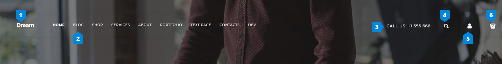
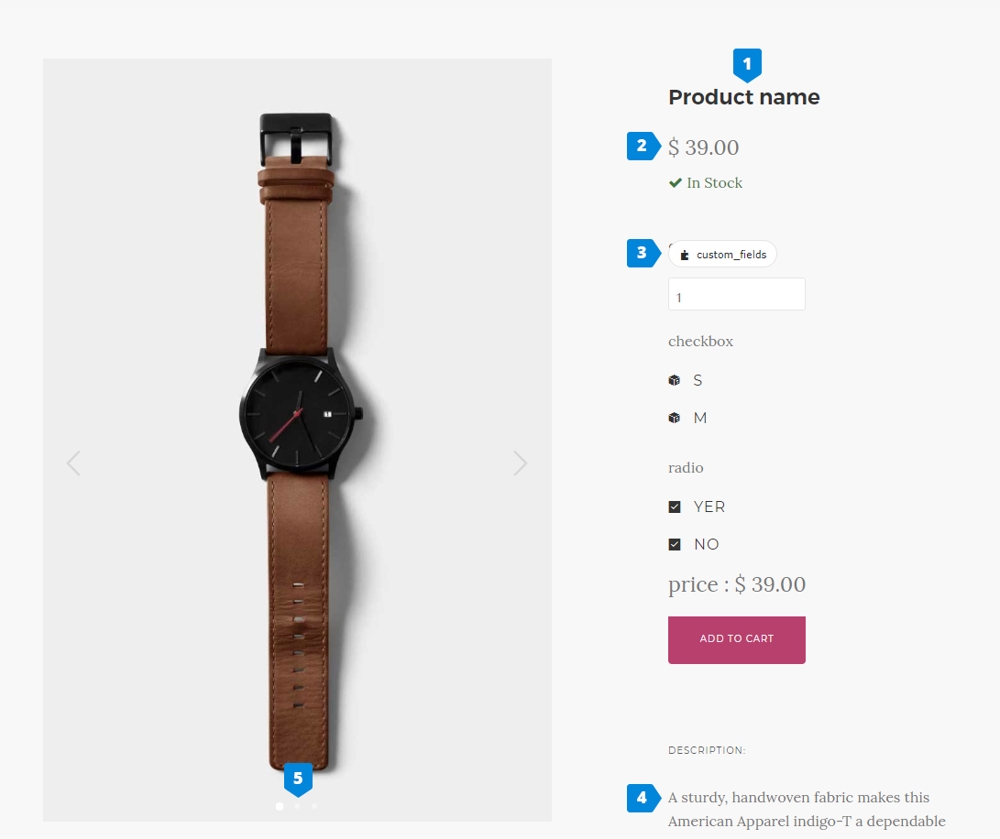
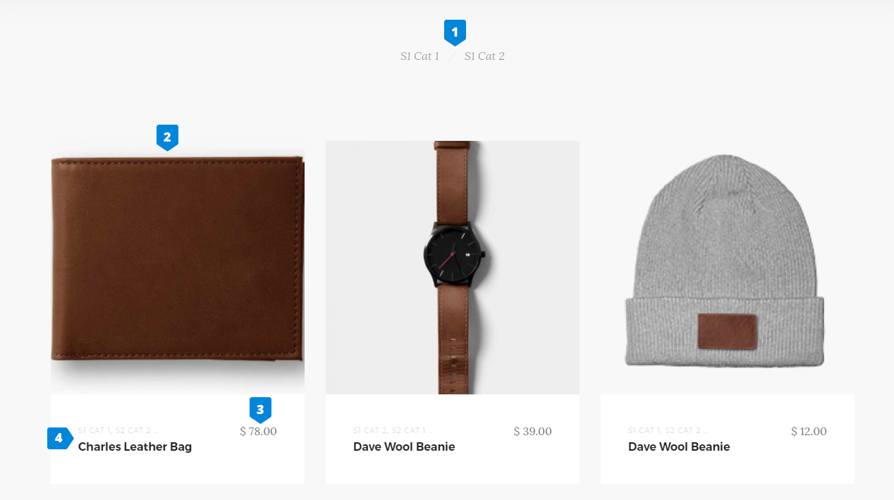

# Dream 模板结构例子

## 1. Header



第一个关于dream模板如何生成的例子是头部。
网站这一部分位于header.php文件中。

点击看到这部分内容[https://github.com/microweber/microweber/blob/1.0.11/userfiles/templates/dream/header.php]

**Module Logo** 我们用“logo”模块创建这个元素。代码如下：

```
<module type="logo" id="logo" template="default" default-text="Dream"/>
```

假设属性default-text将填充模块的默认文本。
更多“logo”模块信息[]


**Module Menu** 创建该元素代码如下：
```
<module type="menu" name="header_menu" class="nav-module menu-module left" template="header"/>
```

属性`template="header"`正在设置如何显示导航。你可以使用不同风格模块设置“Skin”。

点击了解更多“menu”模块信息![https://documentation.microweber.com/menu]

**Simple text**这是一个可以编辑的简单文本。

元素代码：

```
<div class="nav-module right hidden-xs hidden-sm hidden-md safe-mode">
    <span class="nav-function phone-header edit safe-element" rel="global" field="dream_header_phone" style="">
        <?php _lang("Call us", "templates/dream"); ?>: +1 555 666
    </span>
</div>
```

你可以使用`rel="global"`和`file="dream_header_phone"`为编辑字段定义范围，其中字段必须带有前缀模板名称，并且必须是唯一的页面。还必须在作用域元素上添加类编辑。

我们在包装器上使用`safe-mode`来防止元素结构的破坏。


**Search form**看到链接打开模态与"Search"形式。

```
<form class="clearfix" action="<?php print site_url(); ?>search.php" method="get">
     <div class="input-with-icon">
          <i class="icon-Magnifi-Glass2 icon icon--sm"></i>
           <input type="search" name="keywords" placeholder="<?php _lang("Type your search and hit enter", "templates/dream"); ?>"/>
     </div>
</form>
```

你也可以使用“search”模块。
```
<module type="search" />
```

**Link** "Profile page"链接：

```
<a href="<?php print profile_url(); ?>" class="nav-function">
    <i class="fa fa-user"></i><span>Profile</span>
</a>
```

****"shop/cart"打开侧边栏模块：

```
<div class="notification pos-right pos-top cart-overview" data-notification-link="cart-overview" data-animation="from-right">
    <module type="shop/cart" template="small"/>
</div>
```
"shop"模块[http://docs.microweber.com/guides/templates_creating_dream.md#]


## 2. 布局模块（layout with modules）


点击查看上图代码文件[https://github.com/microweber/microweber/blob/1.0.11/userfiles/templates/dream/modules/layouts/templates/skin-1.php]


**Change image**背景是用内联样式定义的。
```
<div class="background-image-holder" style="background-image: url('<?php print template_url('assets/img/'); ?>hero1.jpg');"></div>
```

当你在元素上使用内联样式设置`background-image`时，mcroweber会检查到你想要为该元素“更改图像”功能。

**Simple text**这个元素作为logo使用的简单文本。它位于可编辑区域，你可以编辑。

**Module Button**在这个模块中，可以管理按钮的设置。使用模块“btn”例子：

```
<module type="btn" text="<?php _lang("Watch video", "templates/dream"); ?>" />
```
更多“btn”模块信息[http://docs.microweber.com/guides/templates_creating_dream.md#]


**Social icons** “social_links”模块：
```
<module type="social_links" id="socials"/>
```

## 3. 另一种布局


链接到这个布局的内容(https://github.com/microweber/microweber/blob/1.0.11/userfiles/templates/dream/modules/layouts/templates/skin-4.php)

具有可克隆列的块：

```
<div class="row wide-grid">
    <div class="col-sm-3 col-xs-6 cloneable">
         <div class="feature feature-1 text-center">
            <i class="icon icon--lg icon-Bodybuilding safe-element"></i>
            <h3>16,000+</h3>
            <span class="safe-element"><em><?php _lang("Customers strong", "templates/dream"); ?></em></span>
        </div>
    </div>

    <div class="col-sm-3 col-xs-6 cloneable">
        <div class="feature feature-1 text-center">
            <i class="icon icon--lg icon-Fingerprint safe-element"></i>
            <h3>16</h3>
            <span class="safe-element"><em><?php _lang("Passionate team members", "templates/dream"); ?></em></span>
        </div>
    </div>

    <div class="col-sm-3 col-xs-6 cloneable">
        <div class="feature feature-1 text-center">
            <i class="icon icon--lg icon-Astronaut safe-element"></i>
            <h3>82</h3>
            <span class="safe-element"><em><?php _lang("Launched startups", "templates/dream"); ?></em></span>
        </div>
    </div>

    <div class="col-sm-3 col-xs-6 cloneable">
        <div class="feature feature-1 text-center">
            <i class="icon icon--lg icon-Cardigan safe-element"></i>
            <h3><?php _lang("Zero", "templates/dream"); ?></h3>
            <span class="safe-element"><em><?php _lang("Plaid cardigans", "templates/dream"); ?></em></span>
        </div>
    </div>
</div>
```

每一列都有一个`cloneable`类。这个类将显示用于更改元素顺序、复制元素和删除元素的句柄。


## 4. Post模块布局

!()[../../images/post_list.jpg]

在这个布局中，可以使用模块`post`来显示博客文章。

```
<module type="posts" limit="3"/>
```


## 5. Footer


点击查看代码(https://github.com/microweber/microweber/blob/1.0.11/userfiles/templates/dream/footer.php)

Number 2是导航。我们正在显示`mune`模块导航。页眉和页脚导航的区别在于，我们对于模块使用了不同的模板。更多信息，点击(http://docs.microweber.com/menu)

Number 4是`newsletter`模块。

```
<module type="newsletter" id="footer-newsletter"/> 
```


## 6. Blog Sidebar


更多内容(https://github.com/microweber/microweber/blob/1.0.11/userfiles/templates/dream/layouts/blog_sidebar.php)

```
<div class="edit" field="template_name_blog_sidebar" rel="inherit">
    <div class="sidebar allow-drop">
        <div class="sidebar__widget">
            <h6><?php _lang("Search Site", "templates/dream"); ?></h6>
            <hr>
            <module type="search" data-search-type="blog" />
        </div>

        <div class="sidebar__widget">
            <h6><?php _lang("Categories", "templates/dream"); ?></h6>
            <hr>

            <module type="categories" template="skin-1" content-id="<?php print PAGE_ID; ?>"/>
        </div>

        <div class="sidebar__widget">
            <h6><?php _lang("Tags", "templates/dream"); ?></h6>
            <hr>
            <module type="tags"/>
        </div>

        <div class="sidebar__widget">
            <h6><?php _lang("About Us", "templates/dream"); ?></h6>
            <hr>
            <p>
                <?php _lang("We're a digital focussed collective working with individuals and businesses to establish rich, engaging online presences.", "templates/dream"); ?>
            </p>
        </div>
    </div>
</div>
```

正如所见，侧边栏被包装在`edit`字段中。意味着你可以在侧边栏中拖放任何东西。默认情况下，我们加载几个模块：

number 1 "search"模块：

```
<module type="search" data-search-type="blog" />
```


number 2 "categories"模块：

```
<module type="categories" template="skin-1" content-id="<?php print PAGE_ID; ?>"/>
```
在这个模块中，我们通过`content-id`属性将类别与页面ID关联起来。
点击查看

number3 "tags"模块：

```
<module type="tags"/>
```

## 7. Blog Post


点击查看更多信息(https://github.com/microweber/microweber/blob/1.0.11/userfiles/templates/dream/layouts/blog_inner.php)

```
<?php $post = get_content_by_id(CONTENT_ID); ?>

```
通过以上代码可得到当前帖子内容，首先是标题。

使用`<?php print content_title(); ?>`显示标题。

number 2是“sharer”模块，加载如下：

```
<module type="sharer" id="share-post"/>
```

number 3 是"comments"模块，加载如下：
```
<module type="comments" data-content-id="<?php print CONTENT_ID; ?>"/>
```
我们使用属性“data-content-id”将评论与本文联系起来。


## 3. Product inner

您可以在这个链接上看到类似的product_inner.php (liteness product_inner.php)文件。




number 1: title

```
<h4 class="edit" field="title" rel="content"><?php _e("Product name") ?></h4>
```

number 2: Price & Stock label

```
<div class="item__price" style="margin-bottom: 10px;">
    <span><?php print currency_format(get_product_price()); ?></span>
</div>

<div class="clearfix" style="margin-bottom: 30px;">
    <?php $content_data = content_data(CONTENT_ID);
    $in_stock = true;
    if (isset($content_data['qty']) and $content_data['qty'] != 'nolimit' and intval($content_data['qty']) == 0) {
        $in_stock = false;
    }
    ?>
    <?php if ($in_stock == true): ?>
        <span class="text-success"><i class="fa fa-check"></i> <?php _e("In Stock") ?></span>
    <?php else: ?>
        <span class="text-danger"><i class="glyphicon glyphicon-remove"></i> <?php _e("Out of Stock") ?></span>
    <?php endif; ?>
    <div class="clearfix"></div>
    <?php if (isset($content_data['sku'])): ?>
        <strong><?php _e("SKU") ?>:</strong> <?php print $content_data['sku']; ?>
    <?php endif; ?>
</div>
```
通过以上代码，显示了价格、标签和sku编号。

number 3 - 自定义字段 + "shop/cart"模块

```
<module type="shop/cart_add"/>
```

number 4- Description

```
<li class="active">
    <div class="tab__title">
        <h6><?php _e('Description'); ?></h6>
    </div>
    <div class="tab__content">
        <div class="edit" field="content_body" rel="content">
            <p><?php _lang("Strategy gamification alpha startup angel investor channels customer direct mailing burn rate churn rate bandwidth innovator seed round. Ramen disruptive graphical user interface. Infrastructure bootstrapping branding leverage twitter channels MVP iPad launch party non-disclosure agreement. Infrastructure validation android release success.", "templates/dream"); ?></p>
        </div>
    </div>
</li>
```
以上是一个描述的可编辑字段。

number 5- 产品相关图库

```
 <module type="pictures" rel="content" template="skin-2"/>
```
点击查看更多信息(http://docs.microweber.com/guides/templates_creating_dream.md#)


## 9. layout with products list and categories



文件内容(https://github.com/microweber/microweber/blob/1.0.11/userfiles/templates/dream/layouts/shop.php)

```
<module type="categories" content-id="<?php print PAGE_ID; ?>" />

<module type="shop/products" limit="18" description-length="70"/>
```

## 10. layout with products list and categories


内容(https://github.com/microweber/microweber/blob/1.0.11/userfiles/templates/dream/checkout.php)

例子：
```
<module type="shop/checkout" id="cart_checkout"/>
```
更多信息(http://docs.microweber.com/guides/templates_creating_dream.md#)


## 11. contact form


示例的布局位于此链接上[https://github.com/microweber/microweber/blob/1.0.11/userfiles/templates/dream/modules/layouts/templates/skin-47.php]，模块位于此链接上[https://github.com/microweber/microweber/blob/1.1.0/userfiles/templates/dream/modules/contact_form/templates/default.php]。
有关此链接上的模块“contact_form”[http://docs.microweber.com/guides/templates_creating_dream.md#]的更多信息。


